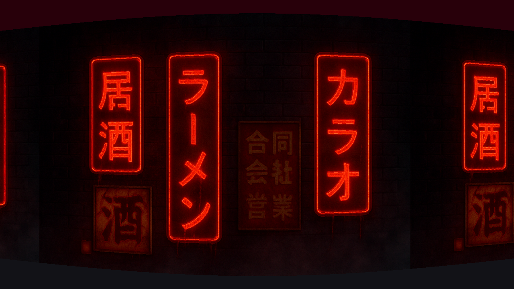

# 🎲 cub3D

**cub3D** is a 3D graphical project inspired by early raycasting engines such as **Wolfenstein 3D**.  
The objective is to render a real-time 3D view from a 2D map using **raycasting**, implemented entirely in **C** with **MLX42**, following the constraints of the **42**.

This project focuses on low-level graphics, mathematics, memory management, and clean modular architecture.

---

## 🧠 Core Concepts

- Raycasting rendering engine
- 2D grid map interpreted as a 3D world
- Texture-mapped walls
- Player movement and camera rotation
- Event-driven rendering loop
- Mandatory and Bonus features

---

## 📁 Project Structure

```
.
├── Makefile
├── MLX42/				# Graphics library
├── include/			# Header file
├── src/
│  ├── cub3D.c
│  ├── ft_cub.c
│  ├── ft_cub_init.c
│  ├── ft_cub_loop.c
│  ├── ft_draw.c
│  ├── ft_move_player.c
│  ├── utils.c
│  └── parcing/			# Parsing module
├── textures/			# PNG textures
├── config/				# .cub map files
├── bonus/				# Bonus features
└── en.subject.pdf
```

---

## 🎮 Controls

|	Key					|	Action				|
|-----------------------|-----------------------|
|	W					| Move forward			|
|	S					| Move backward			|
|	A					| Strafe left			|
|	D					| Strafe right			|
|	← / →				| Rotate camera			|
|	Mouse				| Rotate camera (bonus)	|
|	ESC / Close button	| Exit					|

📌 **Visualization**


---

## 🔁 Execution Flow — From Input to Display

```
Input (.cub)
   ↓
Parsing & Validation
   ↓
Initialization
   ↓
Event Hooks
   ↓
Game Loop
   ↓
Raycasting
   ↓
Projection
   ↓
Texture Mapping
   ↓
Floor / Ceiling
   ↓
Image Buffer
   ↓
Display (MLX42)
```

---

## 🔍 Parsing Phase

- Reads and validates `.cub` files
- Extracts textures, colors, map layout
- Ensures map closure and correctness

📌 Implemented in `src/parcing/`

---

## 🌱 Initialization Phase

- Player position, direction, camera plane
- Texture loading
- MLX window and image buffer creation

📌 Implemented in `ft_cub_init.c`

---

## 🌀 Main Loop & Input Handling

- Keyboard and mouse input processing
- Player movement and collision checks
- Frame-based updates

📌 Implemented in `ft_cub_loop.c` and `ft_move_player.c`

---

## 🧮 Raycasting Explained (Technical Overview)

### ☀️ Raycasting Principle

**Raycasting** renders a 3D scene by casting one ray per vertical screen column.  
Each ray travels through the 2D grid map until it hits a wall. The distance to the wall determines the height of the vertical slice drawn on screen.

---

### ☄️ Ray Direction Calculation

For each screen column `x`:

```c
ray->cam_rate = (2. * x - data->mlx->width) / data->mlx->height;
ray->dir.x = data->player.dir.x + data->player.plane.x * ray->cam_rate;
ray->dir.y = data->player.dir.y + data->player.plane.y * ray->cam_rate;
```

- `data->player.dir` represents the player direction
- `data->player.plane` defines the camera field of view
- `ray->cam_rate` comes from:

```c
// the x-coordinate on the camera plane
cameraX = 2. * x / WIDTH - 1`; // range: [-1 .. +1]

cam_rate = cameraX * (WIDTH / HEIGHT); // range: [-WIDTH/HEIGHT .. +WIDTH/HEIGHT]

/*
(-1 / -WIDTH/HEIGHT)	->	at the left edge of the screen
	(0)					->	at the center
(+1 / +WIDTH/HEIGHT)	->	at the right edge
*/
```

This is an `aspect-ratio-correct` (image keeps the same proportions no matter the window shape)

📌 Implemented in `ft_cub.c` with `ft_ray` function, initialized in `ft_cub_init.c`.

---

### 📐 DDA Algorithm (Digital Differential Analyzer)

The **DDA algorithm** steps through the grid cell-by-cell until a wall is hit

This ensures efficient and precise wall detection

📌 Implemented in `ft_cub.c` with `ft_dda` function.

📌 **Visualization**


---

### 🐟 Fish-Eye Correction

To avoid distortion, the perpendicular wall distance is used:

📌 `ft_perp_wall_dist` function in `ft_cub.c`.

with:

```c
ray->perp_wall_dist = ft_perp_wall_dist(data, ray);
```

#### Explanation

Actually:

```c
dist.delta.x = sqrt(ray->dir.x * ray->dir.x + ray->dir.y * ray->dir.y) / fabs(ray->dir.x);
dist.delta.y = sqrt(ray->dir.x * ray->dir.x + ray->dir.y * ray->dir.y) / fabs(ray->dir.y);
```

And to avoid distortion

```c
if (!ray->side)
	return ((dist.side.x - dist.delta.x) / sqrt(ray->dir.x * ray->dir.x + ray->dir.y * ray->dir.y));
return ((dist.side.y - dist.delta.y) / sqrt(ray->dir.x * ray->dir.x + ray->dir.y * ray->dir.y));
```

In the end `sqrt(ray->dir.x * ray->dir.x + ray->dir.y * ray->dir.y)` cancels out, leaving what you see in `ft_perp_wall_dist` function

#### Wall Height Calculation

```c
ray->line.height = (int)(data->mlx->height / ray->perp_wall_dist);
```

📌 **Visualization**



---

### 🏞️ Texture Mapping

Once a wall is hit:
- The exact hit position is computed
- The corresponding X coordinate of the texture is selected
- Texture pixels are mapped vertically onto the screen slice

📌 Handled in `ft_draw.c`.

---

## ⭐ Bonus Features

- Wall collisions
- Minimap
- Doors (open / close)
- Animation (the bats come out when the door is opened)
- Mouse-based camera rotation

📌 **Visualization**


---

## 🛠 Compilation & Execution

### 📦 Build
```bash
# Clone the repository
git clone git@github.com:zakariatalbii/42_cub3d.git
cd 42_cub3d

# Compile the project
make

# Compile with bonus features
make bonus
```

### ▶️ Example Usage

```bash
./cub3D config/config.cub

# Bonus
./cub3D_bonus config/config_bonus.cub
```

---

## 🖥️ Graphics Library — MLX42

This project uses **MLX42**, a modern graphics library for the **42**.

🔗 Official repository: [**MLX42**](https://github.com/codam-coding-college/MLX42.git)

Used for:

- Window and image buffer management
- Texture loading (PNG)
- Keyboard and mouse input
- Efficient frame rendering

---

## 📚 References

- Raycasting tutorial by Lode Vandevenne: [**lodev**](https://lodev.org/cgtutor/raycasting.html)
- Wolfenstein 3D rendering techniques
- MLX42 documentation

---

## 🏁 Final Notes

**cub3D** is not a game engine — it is a **learning engine**.

This project demonstrates a deep understanding of:
- Raycasting mathematics
- Low-level rendering
- Modular software design
- Collaborative development

---

## 🤝 Team & Responsibilities

This project was developed collaboratively with a strict separation of responsibilities.

### 🧑‍💻 **Zakaria Talbi** — Engine & Rendering Core

**GitHub:** [@zakariatalbii](https://github.com/zakariatalbii)

**Responsible for:**
- Raycasting algorithm and mathematics
- DDA grid traversal and distance projection
- Rendering pipeline and texture mapping
- Player movement, rotation, and collision detection
- MLX window, image buffer, and hooks
- Main game loop
- Bonus features **(Wall collisions, Minimap, Doors, Mouse rotation)**

---

### 🧑‍💻 **Abdelaziz Aboudrar** — Parsing & Validation

**GitHub:** [@abdelaziz12a](https://github.com/abdelaziz12a)

**Responsible for:**
- Parsing `.cub` configuration files
- Texture path and RGB color parsing
- Map reading and validation
- Player spawn detection
- Error handling and input validation
- Bonus feature **(Animation)**

---

## 📜 License

This project is part of the 42 School cursus.